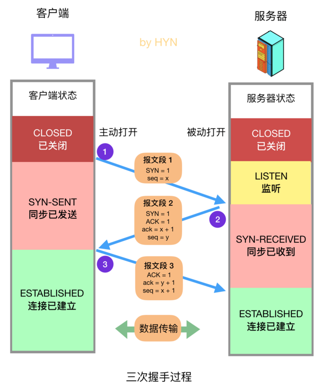
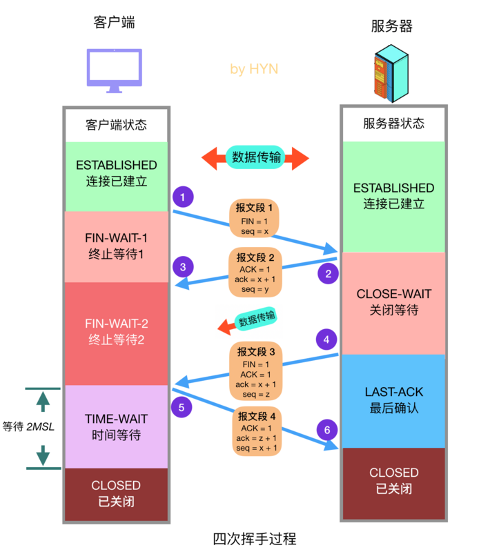

## 1 TCP 连接

### 1.1 建立连接--三次握手

**三次握手过程：**

1. 第一次握手：客户端向服务器发送报文段 1，其中的 SYN 标志位 (前文已经介绍过各种标志位的作用)的值为 1，表示这是一个用于请求发起连接的报文段，其中的序号字段 (Sequence Number，图中简写为 seq)被设置为初始序号 x (Initial Sequence Number，ISN)，TCP 连接双方均可随机选择初始序号。发送完报文段 1 之后，客户端进入 SYN-SENT 状态，等待服务器的确认。

2. 第二次握手：服务器在收到客户端的连接请求后，向客户端发送报文段 2 作为应答，其中 ACK 标志位设置为 1，表示对客户端做出应答，其确认序号字段 (Acknowledgment Number，图中简写为小写 ack) 生效，该字段值为 x + 1，也就是从客户端收到的报文段的序号加一，代表服务器期望下次收到客户端的数据的序号。此外，报文段 2 的 SYN 标志位也设置为 1，代表这同时也是一个用于发起连接的报文段，序号 seq 设置为服务器初始序号 y。发送完报文段 2 后，服务器进入 SYN-RECEIVED 状态。

3. 第三次握手：客户端在收到报文段 2 后，向服务器发送报文段 3，其 ACK 标志位为 1，代表对服务器做出应答，确认序号字段 ack 为 y + 1，序号字段 seq 为 x + 1。此报文段发送完毕后，双方都进入 ESTABLISHED 状态，表示连接已建立。

### 1.2 断开连接--四次挥手

**四次挥手过程：**

1. 客户端发送关闭连接的报文段，FIN 标志位 1，请求关闭连接，并停止发送数据。序号字段 seq = x (等于之前发送的所有数据的最后一个字节的序号加一)，然后客户端会进入 FIN-WAIT-1 状态，等待来自服务器的确认报文。

2. 服务器收到 FIN 报文后，发回确认报文，ACK = 1， ack = x + 1，并带上自己的序号 seq = y，然后服务器就进入 CLOSE-WAIT 状态。服务器还会通知上层的应用程序对方已经释放连接，此时 TCP 处于半关闭状态，也就是说客户端已经没有数据要发送了，但是服务器还可以发送数据，客户端也还能够接收。

3. 客户端收到服务器的 ACK 报文段后随即进入 FIN-WAIT-2 状态，此时还能收到来自服务器的数据，直到收到 FIN 报文段。
4. 服务器发送完所有数据后，会向客户端发送 FIN 报文段，各字段值如图所示，随后服务器进入 LAST-ACK 状态，等待来自客户端的确认报文段。

5. 客户端收到来自服务器的 FIN 报文段后，向服务器发送 ACK 报文，随后进入 TIME-WAIT 状态，等待 2MSL(2 \* Maximum Segment Lifetime，两倍的报文段最大存活时间) ，这是任何报文段在被丢弃前能在网络中存在的最长时间，常用值有 30 秒、1 分钟和 2 分钟。如无特殊情况，客户端会进入 CLOSED 状态。

6. 服务器在接收到客户端的 ACK 报文后会随即进入 CLOSED 状态，由于没有等待时间，一般而言，服务器比客户端更早进入 CLOSED 状态。
